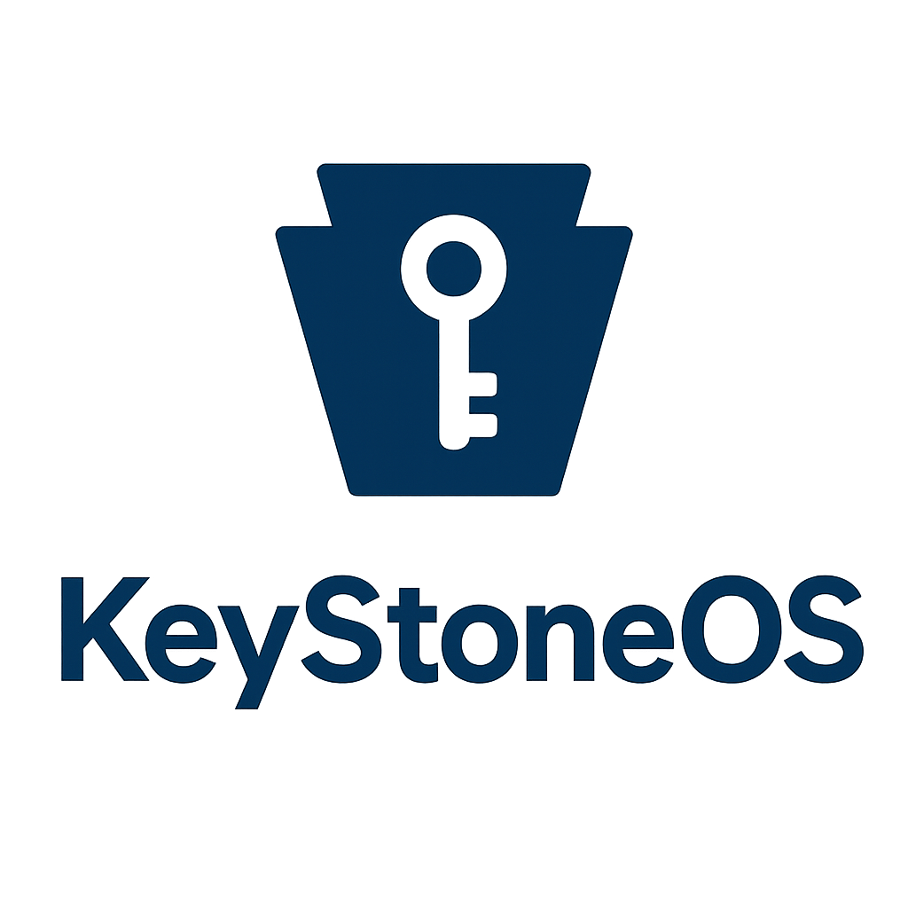

  
  <h1>KeyStoneOS</h1>

  <strong>Um sistema operacional feito por um adolescente de 14 anos para aprender sobre sistemas, drivers, arquivos e memória.</strong>

---

## Sobre

O <strong>KeyStoneOS</strong> é um sistema operacional experimental criado para estudo e aprendizado.  
Ele foi projetado para explorar conceitos avançados como:

- Multitarefa
- Drivers básicos de teclado e mouse 
- Suporte gráfico via VESA genérico

## Funcionalidades

- Kernel com suporte a drivers de teclado e mouse
- Sistema de arquivos FAT16
- Possibilidade de rodar em PC real ou emuladores
- Interface de terminal emulado simples

---

## Compilação e Build

O projeto utiliza Makefiles para compilação. Exemplo:

<pre>
# Compila o kernel e as ferramentas
make

# Executa no emulador
qemu-system-i386 -drive format=raw,file=build/disk.img
</pre>

---

## Contribuição

Este projeto é um <strong>experimento pessoal</strong>, mas você pode contribuir se quiser:  

1. Abrir um fork
2. Criar novas features (drivers, sistemas de arquivos, UI)
3. Fazer pull requests explicando suas alterações

---

## Licença

  
  MIT License - você pode copiar, modificar ou usar para estudo.

---

  <strong>Feito por Matheus Leme Da Silva, 14 anos, para aprender e se divertir</strong>

